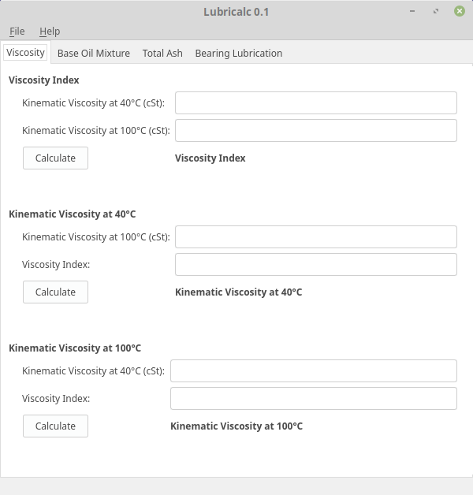

# Lurbicalc

Lubricalc is a desktop application to perform calculations on machinery lubrication.

## Screenshot

## Requirements

Cli uses the following libraries and programs:

 - [PyQt5](https://riverbankcomputing.com/software/pyqt/download5)
 - [Python](https://python.org) > 3.4

## Installation

To install the package:

    sudo python3 setup.py install # This does not install dependencies

## Contributing

Clone the repo and make a pull request!

## Licensing and Patents

Cli is licensed under...

## Authors and Contributors

Authors:

 - [Leodanis Pozo Ramos](mailto:lpozor78@gmail.com)

Contributors:

 - [Contributor name](http://contributor.page.cu/)

## Copyright

Copyright 2016-2018 Leodanis Pozo Ramos.
